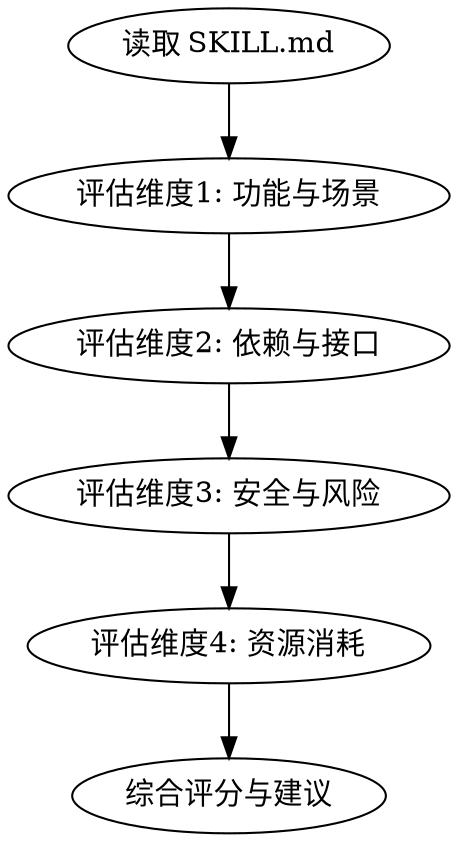

# Skill Checker

作为 find-skills 的补充技能。在发现新 skill 后，用户说"帮我检查下"时自动触发，对该 skill 进行全面评估。

## When to Use

- 用户刚通过 find-skills 找到新 skill，说"帮我检查下"/"检查一下"/"帮我看看"
- 用户想了解某个 skill 是否安全、是否值得安装
- 用户在安装 skill 前想了解其依赖、风险、成本

## Check Flow



## 检查步骤

### 1. 读取并分析 SKILL.md

```bash
# 定位目标 skill 的路径
# 常见位置: ~/.claude/skills/, ~/.claude/plugins/cache/
# 找到后读取 SKILL.md 全文
```

提取关键信息：
- `name` 和 `description` 字段
- 触发条件（When to Use）
- 核心流程和步骤
- 引用的外部工具/脚本
- 是否有 supporting files

### 2. 功能与使用场景评估

| 评估项 | 检查内容 |
|--------|----------|
| 核心功能 | 这个 skill 做什么？解决什么问题？ |
| 使用场景 | 什么情况下会触发？频率如何？ |
| 使用方法 | 触发方式是否自然？是否需要记忆特殊命令？ |
| 与现有技能重叠 | 是否和已安装的 skill 功能重复？ |
| 实用性评分 | 高/中/低 — 对用户的实际价值 |

### 3. 依赖与接口检查

逐项排查：

- [ ] **外部 API** — 是否调用第三方 API（OpenAI、GitHub API、数据库等）？
- [ ] **MCP Server** — 是否要求配置 MCP 接口？
- [ ] **CLI 工具** — 是否依赖 `npx`、`brew` 等安装的外部命令？
- [ ] **系统权限** — 是否需要文件系统、网络、进程等特殊权限？
- [ ] **付费服务** — 是否隐含付费 API 调用（如 OpenAI API key）？
- [ ] **环境变量** — 是否需要设置特定的环境变量？

对每个依赖项标注：
- **必须** — skill 没有它不能工作
- **可选** — 有则增强，无则降级

### 4. 安全与风险评估

| 风险类型 | 检查要点 |
|----------|----------|
| **数据泄露** | 是否向外部服务发送用户数据/代码/文件内容？ |
| **代码执行** | 是否执行任意 shell 命令？是否经过用户确认？ |
| **文件操作** | 是否修改/删除文件？是否有误操作风险？ |
| **网络请求** | 是否有隐藏的网络请求？URL 是否可审计？ |
| **凭据暴露** | 是否要求 API key？存储方式是否安全？ |
| **供应链风险** | 是否 `npx` 拉取远程代码？来源是否可信？ |

风险规避建议格式：
```
风险：[具体风险]
规避：[具体操作建议]
严重程度：高/中/低
```

### 5. 资源消耗评估

| 资源维度 | 评估方法 |
|----------|----------|
| **Token 消耗** | SKILL.md 的大小（行数/字数）→ 每次加载消耗的 token 数 |
| **内存占用** | 是否在后台运行进程？是否创建大型数据结构？ |
| **磁盘占用** | skill 文件总大小 + 依赖工具的大小 |
| **网络带宽** | 是否频繁请求外部 API？每次请求的数据量 |

Token 估算参考：
- 1 行英文 ≈ 15 tokens
- 1 行中文 ≈ 20-25 tokens
- SKILL.md < 100 行 = 低消耗
- SKILL.md 100-300 行 = 中等消耗
- SKILL.md > 300 行 = 高消耗，考虑是否值得每次加载

### 6. 综合评估报告

输出格式：

```markdown
## Skill 检查报告: [skill-name]

### 概要
- **功能**：一句话说明
- **实用性**：⭐ 高/中/低
- **安全性**：⭐ 高/中/低
- **资源消耗**：⭐ 低/中/高

### 功能分析
[核心功能、使用场景、与现有技能重叠情况]

### 依赖项
| 依赖 | 类型 | 是否必须 | 说明 |
|------|------|----------|------|

### 安全风险
| 风险 | 严重程度 | 规避方法 |
|------|----------|----------|

### 资源消耗
- Token: 约 XXX tokens/次加载
- 内存: 低/中/高
- 磁盘: XX KB

### 建议
✅ 推荐安装 / ⚠️ 谨慎安装 / ❌ 不推荐安装
[理由]
```

## Common Mistakes

| 错误 | 正确做法 |
|------|----------|
| 只看 description 就下结论 | 必须读取完整 SKILL.md |
| 忽略 supporting files | 检查目录下所有文件，脚本文件可能包含风险操作 |
| 低估 token 成本 | 估算大文件的每次加载成本 |
| 忽略间接依赖 | 追踪 skill 调用的工具链，不只看直接依赖 |

## 与 find-skills 的协作


find-skills 负责发现，skill-checker 负责评估。两者独立但互补。
